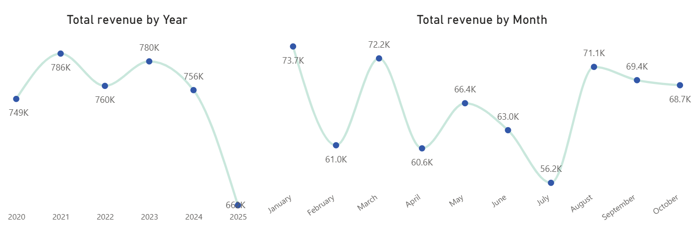
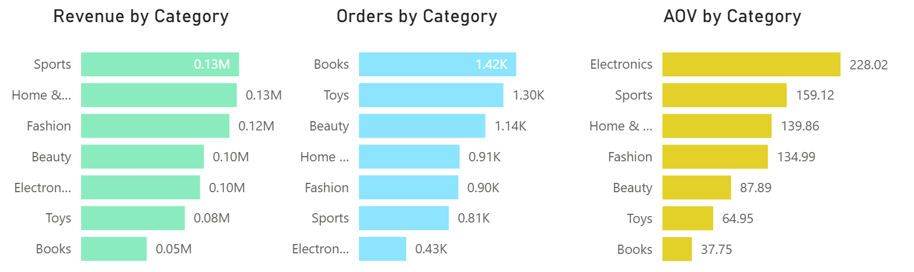
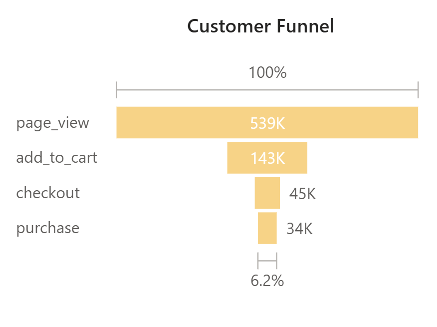
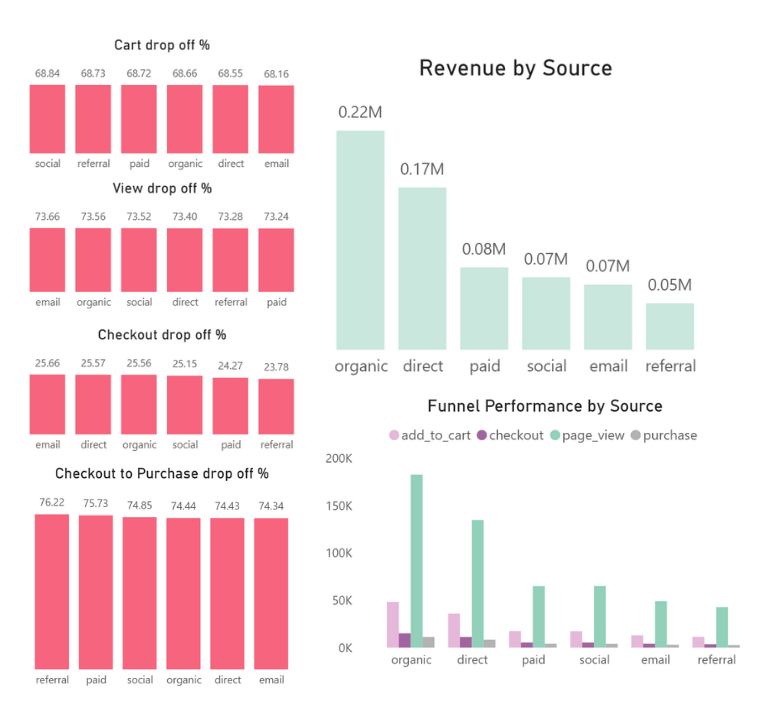
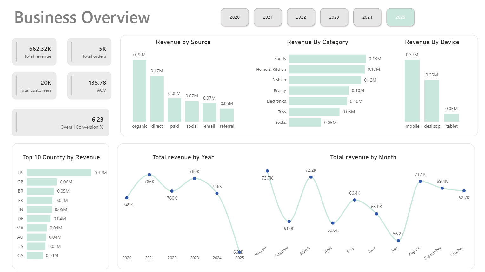
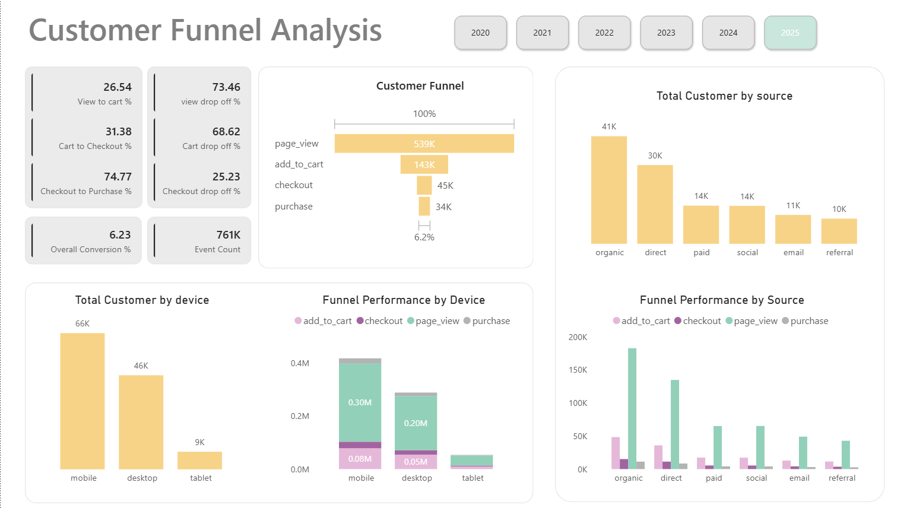
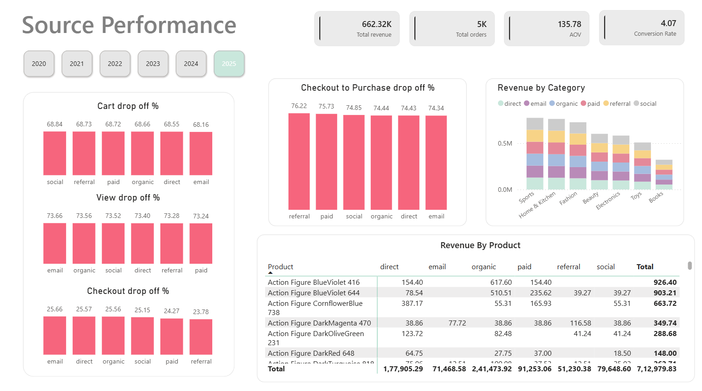
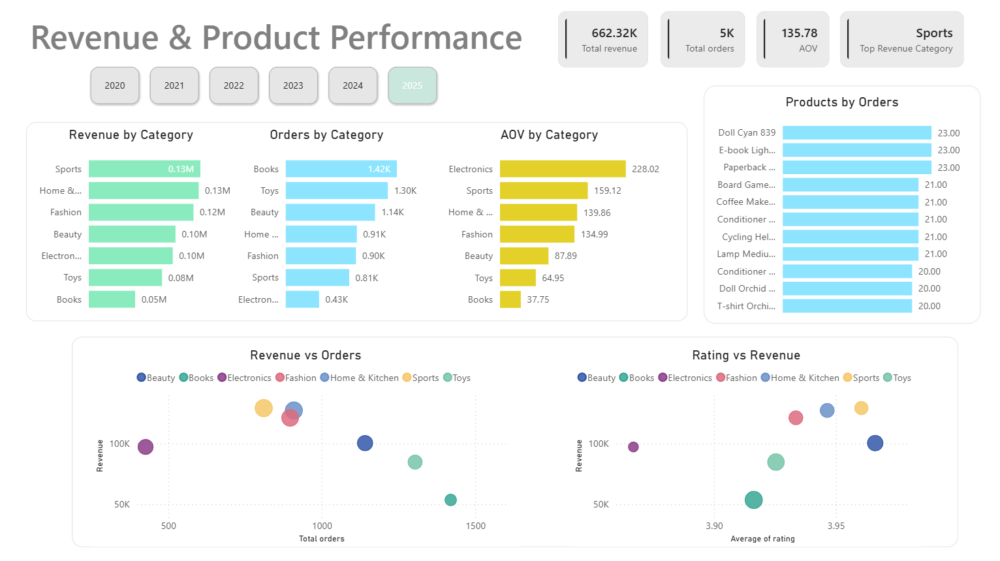

# E-Commerce Conversion & Revenue Analytics

An end-to-end analysis of an e-commerce company's customer journey — from first page view to completed purchase — built to answer one question leadership actually asks: where is revenue being lost, and what should we fix first. PostgreSQL for data modeling and validation, SQL for the initial business queries, Power BI and DAX for the reporting layer, now filterable by year so a stakeholder can ask "how does this year compare" without waiting on a new report.

---

## The Business Problem

The company sells across seven product categories, six acquisition channels, and three device types, and reaches customers in 17 countries. Marketing spends against a funnel — page view, add to cart, checkout, purchase — but nobody had broken that funnel down by channel, device, or category to see where the actual leak is. Revenue and order data existed, but "why isn't more of that traffic converting" didn't have an answer anyone could point to, and there was no way to tell whether this year was actually better or worse than last without pulling a fresh export.

Three questions shaped the analysis:

1. At which stage of the funnel are customers actually dropping off, and is it consistent across channels and devices, or concentrated somewhere specific?
2. Which acquisition channels are worth more spend — by volume, and separately, by how well they convert?
3. Which product categories generate revenue because of volume, and which generate it because of price — and does that pattern hold up year over year, or was it a one-off?

## Who Would Use This

| Team | What they'd pull from it |
|---|---|
| Growth / Performance Marketing | Which channels to fund based on both revenue volume and conversion efficiency |
| Product / UX | Exactly where in the funnel customers give up, to prioritize what gets fixed |
| Category / Merchandising | Which categories monetize through volume vs. price, and whether that's a stable pattern or year-specific |
| CRM / Lifecycle Marketing | Where email and other owned channels are underperforming |
| Finance / Leadership | Revenue, AOV, and conversion rate at a glance, filterable by year |

---

## Tools, and Why Each One Is There

This isn't a one-tool project, and each layer exists because the one before it couldn't do that job on its own.

**PostgreSQL** — the source of truth. Seven related tables (customers, sessions, events, orders, order_items, products, reviews) needed real foreign-key relationships and constraints, not seven loosely-related CSVs. Doing that in a relational database meant I could catch structural problems — like the `product_id` type mismatch described below — before they ever reached a dashboard.

**SQL** — the first pass at every business question, run directly against the database. Before building a single visual, I wanted to know the actual answer (total revenue, drop-off by stage, revenue by category) from the source, so that when Power BI showed a number later, I had something independent to check it against instead of trusting the dashboard by default.

**Power BI** — the layer stakeholders actually touch. SQL answers one question at a time; leadership needed to slice by year, device, and source themselves without filing a request each time. That's the entire reason the Year filter exists on every page now — the business asked "how's this year tracking," not "what was the answer in June."

**DAX** — because "conversion rate" and "drop-off %" aren't columns that exist in the raw tables. They have to be defined once, correctly, so they recalculate under any combination of slicers instead of being hardcoded for one view. The `_Measures` table holds that logic in one place instead of scattering formulas across visuals.

---

## About the Dataset

This project runs on a simulated e-commerce funnel dataset — seven related tables covering customers, sessions, on-site events (page view / add to cart / checkout / purchase), orders, order items, products, and reviews, spanning roughly 34,000 orders and 539,000 tracked events across 2020–2025.

A note on sourcing: I originally set out to build this against the [Brazilian E-Commerce dataset by Olist on Kaggle](https://www.kaggle.com/datasets/olistbr/brazilian-ecommerce), but that dataset is real, anonymized order data from a single country (Brazil) with no clickstream or funnel events in it — no page views, no add-to-cart events, no session or device data. To answer the funnel and channel questions this project is actually built around, I designed a schema that layers session- and event-level tracking on top of a standard orders/products/customers structure, similar in spirit to what Olist provides but built to support funnel analysis specifically. Worth knowing before treating the country and channel figures as anything other than illustrative.

---

## Data Model

Star schema in Power BI: `orders` and `order_items` as the transactional core, `events` and `sessions` capturing the pre-purchase funnel, `customers`, `products`, and `reviews` as dimensions, plus a separate `_Measures` table holding the DAX layer (Add to Cart, AOV, Cart Drop-off %, Cart-to-Checkout %) and a `Funnel Stage` table used to keep the funnel steps in the correct order in visuals.


The SQL layer (`/SQL Scripts`) mirrors this build order: `Table_create.sql` sets up the schema, `Data_validation.sql` checks for duplicates, nulls, and row counts across all seven tables, and `Data_analysis.sql` holds the funnel and revenue queries. One thing worth calling out from that first file: joining `events` to `products` kept returning zero rows during validation, because `product_id` was stored as text in one table and numeric in the other. Rather than casting it inline in every query, I rebuilt the `events` table with the correct type once and dropped the old version — a small thing, but it's the difference between a query that happens to work and a schema that's actually correct.

**One thing I'm flagging rather than fixing quietly:** since adding the Year filter, revenue, orders, and category figures respond to it correctly, but the funnel and drop-off numbers (page views, cart adds, checkout, purchase, and every drop-off % on the Source Performance page) stay identical no matter which year is selected — they still show the full 2020–2025 totals. That points to `events` not being properly related to the date dimension the slicer runs on. Similarly, the "Conversion Rate" KPI on the Source Performance page (4.07% for 2025) doesn't match the "Overall Conversion %" shown on the Business Overview and Funnel pages for the same filter (6.23%), which means those two measures are defined differently and worth reconciling. I'm noting both here instead of quietly picking whichever number looks better, because a dashboard that gives two different answers to "what's our conversion rate" is a real problem, not a rounding issue.

---

## What the Data Shows

**2025 looks like the weakest year on paper — but it isn't finished yet.** Revenue by year has been remarkably flat: $749K (2020), $786K (2021, the high point), $760K (2022), $780K (2023), $756K (2024) — and $662K for 2025 so far. But the monthly breakdown shows 2025 only has ten months of data (January through October), not twelve. Annualized at its current run rate, 2025 is on pace for roughly $795K — which would make it the strongest year yet, not the weakest. That's the difference between reading a bar chart and reading a bar chart correctly.



**The volume-vs-value split in categories isn't a fluke — it holds in the 2025 slice too.** Across all years, Books lead every category in order count but sit last in both revenue and AOV; Electronics has the fewest orders of any category but the highest AOV by a wide margin. Filtered to 2025 alone, the exact same shape reappears: Books still lead on orders (1.42K) while sitting last on AOV ($37.75), and Electronics still has the fewest orders (0.43K) with the highest AOV ($228.02, almost identical to the $229.58 all-time figure). Seeing the same pattern survive a year-over-year filter is what separates a structural finding from a coincidence. The one genuine shift: Home & Kitchen has been the all-time revenue leader, but in the 2025 slice Sports has pulled essentially even with it ($0.13M each) and is nominally on top — worth watching next year to see if that's a real category shift or a one-year blip.



**Nearly three-quarters of visitors never make it past the first step.** Of 539K tracked page views (full history, per the caveat above), only 143K result in an add-to-cart — a 73.5% drop-off before a customer even signals intent. From there, the funnel actually holds up reasonably well: 74.8% of people who reach checkout complete the purchase. The story here isn't "customers are hesitant to buy," it's "most visitors never engage with a product enough to consider buying" — which points at product-page experience, not checkout friction, as the place to spend engineering and design effort.



**The channel that makes the most money isn't the channel that converts best — and this shape is consistent whether you look at 2025 revenue or all-time.** In the 2025 revenue split, Organic still leads ($0.22M) with Direct second ($0.17M), the same ordering as the full-history numbers ($1.50M and $1.12M). But checkout-to-purchase conversion — which reflects the full event history — tells a different story: referral converts at 76.2%, the best of any channel, despite being the lowest-revenue channel by volume. Email sits at the other end, with the worst checkout-to-purchase rate (74.3%) despite moderate revenue. Organic and Direct are scale plays; referral is worth disproportionate investment relative to its current size; email needs a checkout-experience fix, not more send volume.



---

## Recommendations

| Recommendation | Why | Expected impact |
|---|---|---|
| Don't read 2025 as a down year without annualizing first | Ten months of data at the current pace projects to the best year on record, not the worst | Prevents a wrong conclusion from driving budget decisions |
| Prioritize product-page engagement (imagery, reviews, load speed) over checkout optimization | 73.5% of the funnel loss happens before add-to-cart; checkout already converts well | Largest single lever on overall conversion rate |
| Shift incremental budget toward referral, and audit the email checkout flow specifically | Referral converts best per visitor; email has the worst checkout-to-purchase rate | Better return per acquisition dollar, not just more traffic |
| Increase traffic investment in Electronics | Highest AOV category by a wide margin, confirmed in both all-time and 2025-only views | Revenue growth without needing new categories |
| Revisit Books pricing and bundling | High demand isn't converting to revenue — an AOV problem, not a traffic problem, and it's a persistent pattern | Improves monetization of an already-large audience |
| Fix the Year-filter gap on the events table and reconcile the two conversion-rate measures | Funnel and drop-off numbers currently don't respond to the Year slicer, and two pages report different conversion rates for the same period | A dashboard stakeholders can trust without double-checking |

---

## Dashboards

Screens below are filtered to 2025; every page carries the same Year selector for 2020–2025.

**Business Overview** — revenue, orders, customers, AOV, and conversion rate at a glance, with breakdowns by source, device, category, and country, plus revenue trends by year and by month.



**Customer Funnel Analysis** — the page view → add to cart → checkout → purchase funnel, with drop-off rates at each stage and funnel performance split by device and source.



**Source Performance** — revenue, drop-off, and conversion by acquisition channel, plus a product-by-source revenue breakdown.



**Revenue & Product Performance** — revenue, orders, and AOV by category, plus revenue-vs-orders and rating-vs-revenue comparisons to separate volume-driven categories from price-driven ones.



---

## Repository Structure

```
customer-conversion-funnel-analysis/
├── Dataset/           raw CSVs (customers, sessions, events, orders, order_items, products, reviews)
├── SQL Scripts/        Table_create.sql, Data_validation.sql, Data_analysis.sql
├── PowerBI/             Funnel_Analysis.pbix
├── Images/              dashboard exports and data model diagram used in this README
└── README.md
```

---

## Author

**James Aloycious**
SQL · PostgreSQL · Power BI · DAX · Python
