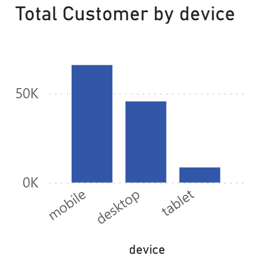

# E-Commerce Conversion & Revenue Analytics

An end-to-end analysis of an e-commerce company's customer journey — from first page view to completed purchase — built to answer one question leadership actually asks: where is revenue being lost, and what should we fix first. PostgreSQL for data modeling and validation, SQL for the initial business queries, Power BI and DAX for the reporting layer.

**Tools:** PostgreSQL · SQL · Power BI · DAX

---

## The Business Problem

The company sells across seven product categories, six acquisition channels, and three device types, and reaches customers in 17 countries. Marketing spends against a funnel — page view, add to cart, checkout, purchase — but nobody had broken that funnel down by channel, device, or category to see where the actual leak is. Revenue and order data existed, but "why isn't more of that traffic converting" didn't have an answer anyone could point to.

Three questions shaped the analysis:

1. At which stage of the funnel are customers actually dropping off, and is it consistent across channels and devices, or concentrated somewhere specific?
2. Which acquisition channels are worth more spend — by volume, and separately, by how well they convert?
3. Which product categories generate revenue because of volume, and which generate it because of price — and does the business know the difference?

## Who Would Use This

| Team | What they'd pull from it |
|---|---|
| Growth / Performance Marketing | Which channels to fund based on both revenue volume and conversion efficiency |
| Product / UX | Exactly where in the funnel customers give up, to prioritize what gets fixed |
| Category / Merchandising | Which categories monetize through volume vs. price, and where the gaps are |
| CRM / Lifecycle Marketing | Where email and other owned channels are underperforming |
| Finance / Leadership | Revenue, AOV, and conversion rate at a glance, filterable by year |

---

## About the Dataset

This project runs on a simulated e-commerce funnel dataset — seven related tables covering customers, sessions, on-site events (page view / add to cart / checkout / purchase), orders, order items, products, and reviews, spanning roughly 34,000 orders and 539,000 tracked events.

A note on sourcing: I originally set out to build this against the [Brazilian E-Commerce dataset by Olist on Kaggle](https://www.kaggle.com/datasets/olistbr/brazilian-ecommerce), but that dataset is real, anonymized order data from a single country (Brazil) with no clickstream or funnel events in it — no page views, no add-to-cart events, no session or device data. To answer the funnel and channel questions this project is actually built around, I designed a schema that layers session- and event-level tracking on top of a standard orders/products/customers structure, similar in spirit to what Olist provides but built to support funnel analysis specifically. Worth knowing before treating the country and channel figures as anything other than illustrative.

---

## Data Model

Star schema in Power BI: `orders` and `order_items` as the transactional core, `events` and `sessions` capturing the pre-purchase funnel, `customers`, `products`, and `reviews` as dimensions, plus a separate `_Measures` table holding the DAX layer (Add to Cart, AOV, Cart Drop-off %, Cart-to-Checkout %) and a `Funnel Stage` table used to keep the funnel steps in the correct order in visuals.


The SQL layer (`/SQL Scripts`) mirrors this build order: `Table_create.sql` sets up the schema, `Data_validation.sql` checks for duplicates, nulls, and row counts across all seven tables, and `Data_analysis.sql` holds the funnel and revenue queries. One thing worth calling out from that first file: joining `events` to `products` kept returning zero rows during validation, because `product_id` was stored as text in one table and numeric in the other. Rather than casting it inline in every query, I rebuilt the `events` table with the correct type once and dropped the old version — a small thing, but it's the difference between a query that happens to work and a schema that's actually correct.

---

## What the Data Shows

**Nearly three-quarters of visitors never make it past the first step.** Of 539K tracked page views, only 143K result in an add-to-cart — a 73.5% drop-off before a customer even signals intent. From there, the funnel actually holds up reasonably well: 74.8% of people who reach checkout complete the purchase. The story here isn't "customers are hesitant to buy," it's "most visitors never engage with a product enough to consider buying" — which points at product-page experience, not checkout friction, as the place to spend engineering and design effort.


**Device drives volume, not conversion quality.** Mobile accounts for the most sessions and the most revenue ($2.50M of the $4.49M total), with desktop well behind and tablet marginal. But the funnel shape — the ratio of add-to-cart, checkout, and purchase — holds steady across all three devices. That's a useful negative result: a mobile-specific redesign is not where the conversion problem lives, so it shouldn't be where the next quarter's UX budget goes either.



**The channel that makes the most money isn't the channel that converts best.** Organic leads on revenue ($1.50M), with direct second ($1.12M) — but referral, the lowest-revenue channel by volume ($0.37M), converts checkout-to-purchase at 76.2%, the best of any channel. Email sits at the other end: middling revenue and the worst checkout-to-purchase rate (74.3%), meaning the highest abandonment right at the finish line. That's two different problems wearing one label — organic and direct are scale plays, referral is worth disproportionate investment relative to its current size, and email needs a checkout-experience fix, not more send volume.


**Books sell often and earn little; Electronics does the opposite.** Books lead every category in order count (9.9K orders) but sit last in both revenue ($0.38M) and average order value ($38.59). Electronics is the mirror image — fewest orders of any category (3.0K) but the highest AOV by a wide margin ($229.58, nearly 6x Books). Home & Kitchen is the category actually worth studying: it's the revenue leader ($0.84M) without needing extreme volume or price, sitting in the middle on both. Books has a monetization problem, not a demand problem; Electronics has a traffic problem, not a value problem.


---

## Recommendations

| Recommendation | Why | Expected impact |
|---|---|---|
| Prioritize product-page engagement (imagery, reviews, load speed) over checkout optimization | 73.5% of the funnel loss happens before add-to-cart; checkout already converts well | Largest single lever on overall conversion rate |
| Shift incremental budget toward referral, and audit the email checkout flow specifically | Referral converts best per visitor; email has the worst checkout-to-purchase rate | Better return per acquisition dollar, not just more traffic |
| Increase traffic investment in Electronics | Highest AOV category by a wide margin, currently the lowest-volume category | Revenue growth without needing new categories |
| Revisit Books pricing and bundling | High demand isn't converting to revenue — an AOV problem, not a traffic problem | Improves monetization of an already-large audience |
| Deprioritize device-specific redesigns | Funnel shape is consistent across mobile, desktop, and tablet | Frees budget for the product-page work that actually moves the number |

---

## Dashboards

**Business Overview** — revenue, orders, customers, AOV, and conversion rate at a glance, with breakdowns by source, device, category, and country.


**Customer Funnel Analysis** — the page view → add to cart → checkout → purchase funnel, with drop-off rates at each stage and funnel performance split by device and source.


**Source Performance** — revenue, drop-off, and conversion by acquisition channel, plus a product-by-source revenue breakdown.


**Revenue & Product Performance** — revenue, orders, and AOV by category, plus revenue-vs-orders and rating-vs-revenue comparisons to separate volume-driven categories from price-driven ones.


---

## Repository Structure

```
customer-conversion-funnel-analysis/
├── Dataset/           raw CSVs (customers, sessions, events, orders, order_items, products, reviews)
├── SQL Scripts/        Table_create.sql, Data_validation.sql, Data_analysis.sql
├── PowerBI/             Funnel_Analysis.pbix
├── Images/              dashboard exports and data model diagram used in this README
└── README.md
```

---

## Author

**James Aloycious**
SQL · PostgreSQL · Power BI · DAX · Python
