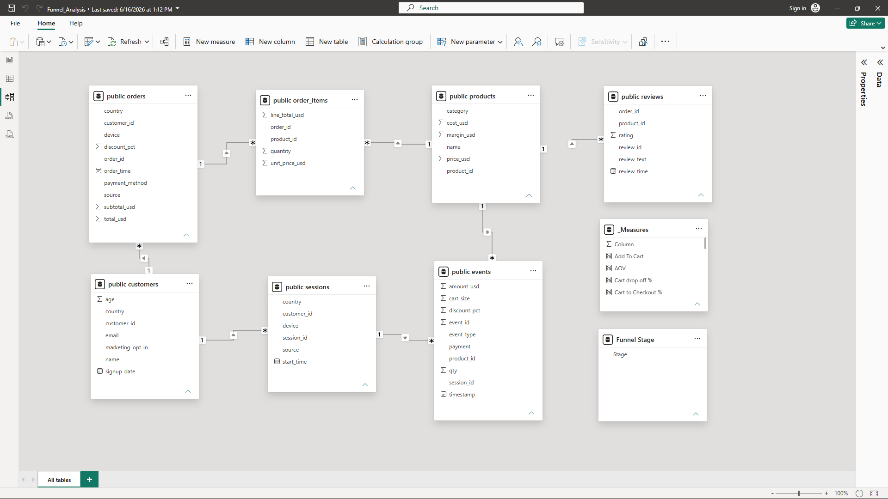
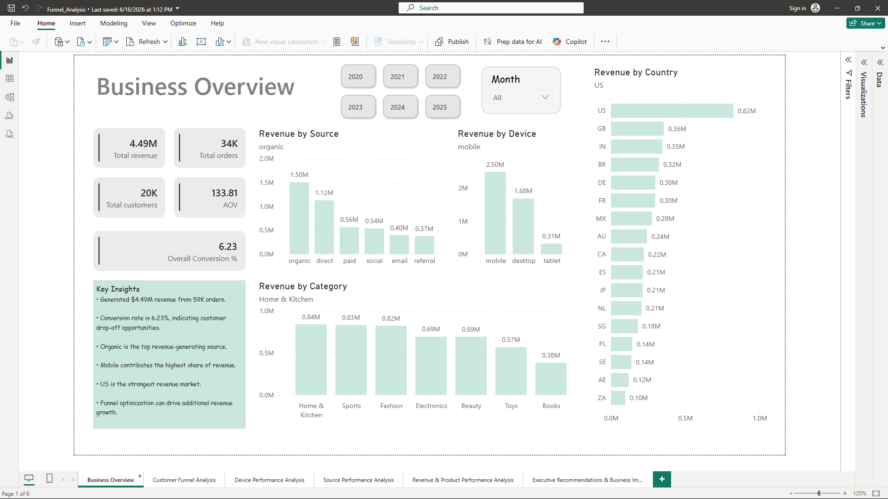
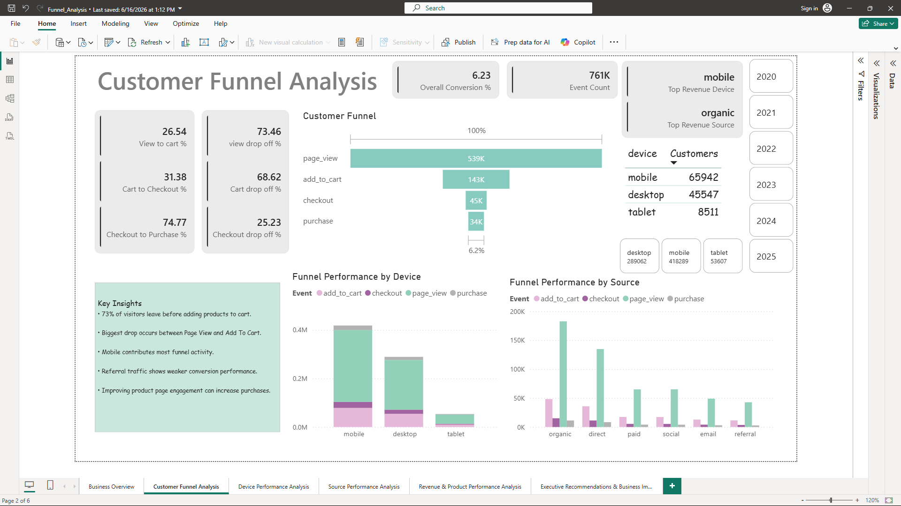
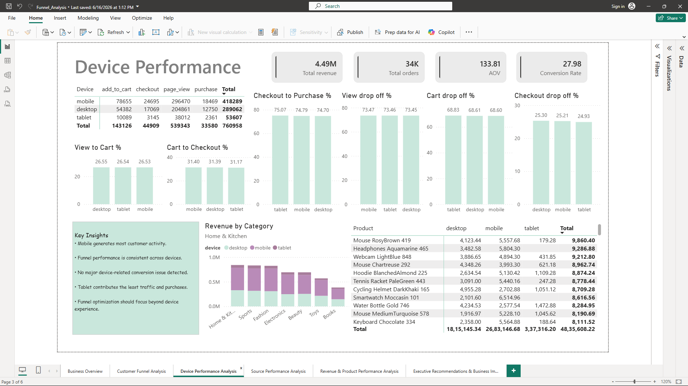
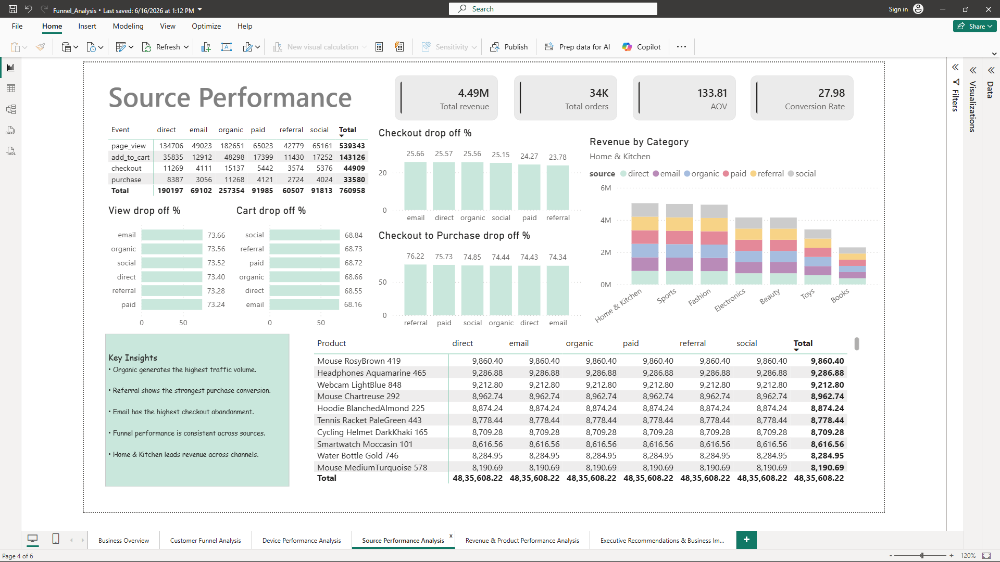
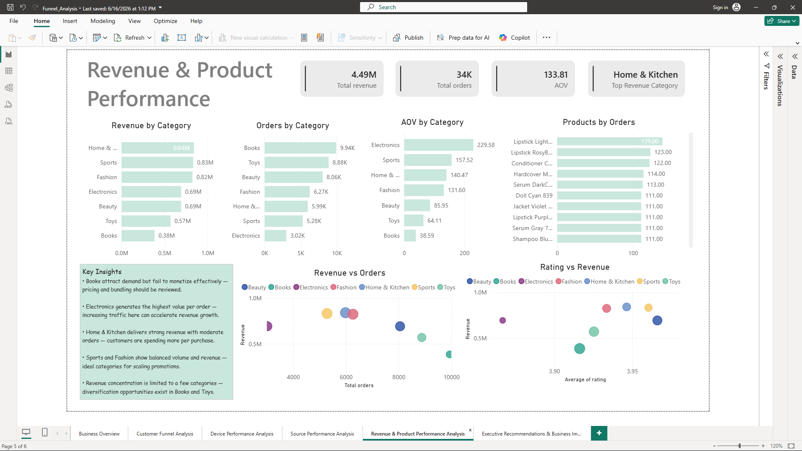
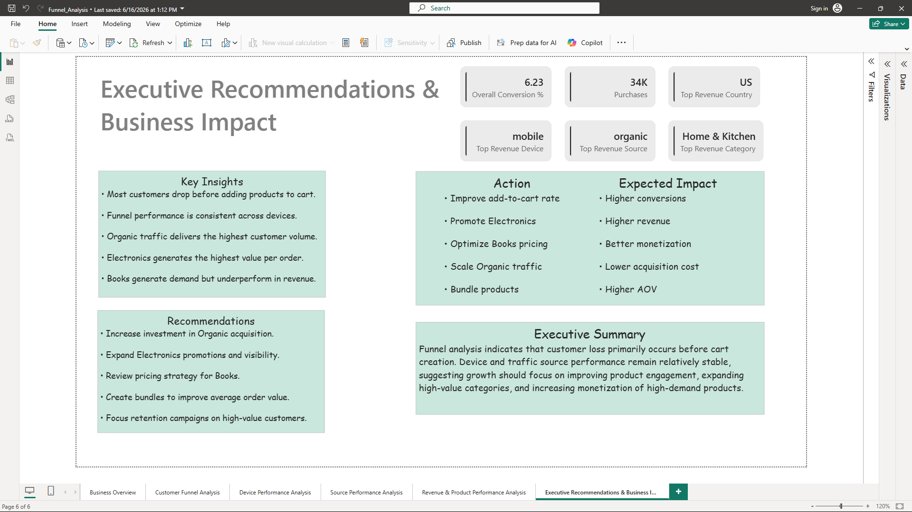

# Customer Conversion Funnel Analysis

## Project Overview

This project analyzes customer behavior across the complete e-commerce conversion funnel using PostgreSQL and Power BI.

The objective is to identify where customers drop off, understand revenue-driving factors, evaluate device and traffic source performance, and provide actionable business recommendations that improve conversion and revenue.

---

## Business Problem

An e-commerce company wants to understand:

- Why customers fail to complete purchases.
- Which channels generate the highest-value customers.
- Which devices contribute most to revenue.
- Which product categories drive growth.
- How conversion performance impacts overall revenue.

The analysis transforms raw customer activity into actionable business insights for decision-makers.

---

## Project Architecture

```text
Customer Data
      ↓
PostgreSQL Database
      ↓
SQL Validation & Analysis
      ↓
Power BI Data Modeling
      ↓
DAX Measures & KPIs
      ↓
Interactive Dashboard
      ↓
Executive Recommendations
```

---

## Tech Stack

| Tool | Purpose |
|--------|----------|
| PostgreSQL | Data Storage |
| SQL | Data Validation & Analysis |
| Power BI | Dashboard Development |
| DAX | KPI & Funnel Calculations |
| Data Modeling | Relationship Management |

---

## Dataset Structure

The project uses seven interconnected business tables.

| Table | Description |
|---------|---------|
| customers | Customer information |
| sessions | Website sessions |
| events | Customer activity events |
| orders | Customer purchase records |
| order_items | Product-level transaction details |
| products | Product catalog |
| reviews | Customer ratings and reviews |

---

## Data Model



---

# Dashboard Pages

## 1. Business Overview

Provides an executive summary of:

- Revenue
- Orders
- Customers
- Conversion Rate
- Revenue by Country
- Revenue by Device
- Revenue by Source
- Revenue by Category



---

## 2. Customer Funnel Analysis

Tracks customer movement through:

Page View → Add To Cart → Checkout → Purchase

Key objective:

Identify the largest customer drop-off stage.



---

## 3. Device Performance Analysis

Evaluates funnel performance across:

- Mobile
- Desktop
- Tablet

Focus:

Understanding customer behavior by device.



---

## 4. Source Performance Analysis

Compares:

- Organic
- Direct
- Email
- Paid
- Social
- Referral

Focus:

Finding the highest-performing acquisition channel.



---

## 5. Revenue & Product Performance Analysis

Analyzes:

- Revenue by Category
- Orders by Category
- Average Order Value
- Product Performance
- Revenue vs Ratings



---

## 6. Executive Recommendations

Converts analytical findings into business actions.

Focus:

Helping leadership teams make data-driven decisions.



---

# Key Business Insights

### Funnel Performance

- 73% of visitors leave before adding products to cart.
- The largest revenue opportunity exists at the product engagement stage.
- Improving Add-to-Cart conversion can significantly increase revenue.

### Acquisition Performance

- Organic traffic generates the highest customer volume and revenue.
- Referral traffic delivers the strongest purchase conversion efficiency.
- Email traffic shows higher checkout abandonment.

### Device Performance

- Mobile drives the majority of customer activity.
- Conversion performance remains consistent across devices.
- Device experience is not the primary conversion bottleneck.

### Revenue Performance

- Home & Kitchen generates the highest revenue.
- Electronics produces the highest Average Order Value.
- Books generate strong demand but weak revenue contribution.

---

# Executive Recommendations

| Recommendation | Expected Business Impact |
|----------------|--------------------------|
| Improve product-page engagement | Increase Add-to-Cart rate |
| Expand Electronics promotions | Increase revenue growth |
| Review Books pricing strategy | Improve monetization |
| Scale Organic acquisition | Lower customer acquisition cost |
| Create product bundles | Increase AOV |

---

# Business Impact

This analysis identifies:

- Revenue leakage points
- Customer conversion bottlenecks
- High-performing acquisition channels
- Device-specific opportunities
- Product monetization opportunities

The recommendations provide a roadmap for improving conversion efficiency and maximizing revenue growth.

---

# Repository Structure

```text
customer-conversion-funnel-analysis
│
├── Dataset
│   ├── customers.csv
│   ├── sessions.csv
│   ├── events.csv
│   ├── orders.csv
│   ├── order_items.csv
│   ├── products.csv
│   └── reviews.csv
│
├── Images
│   ├── business_overview.png
│   ├── customer_funnel.png
│   ├── data_model.png
│   ├── device_analysis.png
│   ├── source_analysis.png
│   ├── revenue_analysis.png
│   └── Executive_summary.png
│
├── PowerBI
│   └── Funnel_Analysis.pbix
│
├── SQL Scripts
│   ├── Table_create.sql
│   ├── Data_validation.sql
│   └── Data_analysis.sql
│
└── README.md
```

---

# Author

### James Aloycious

Data Analyst | SQL | PostgreSQL | Power BI | DAX | Python
